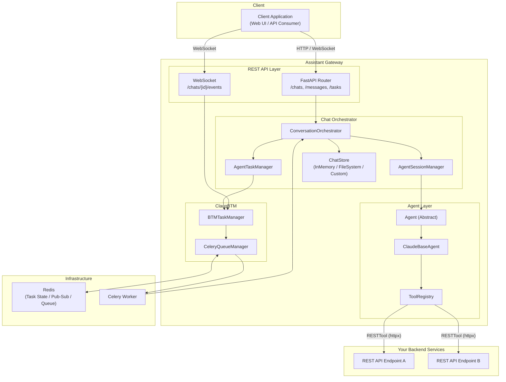
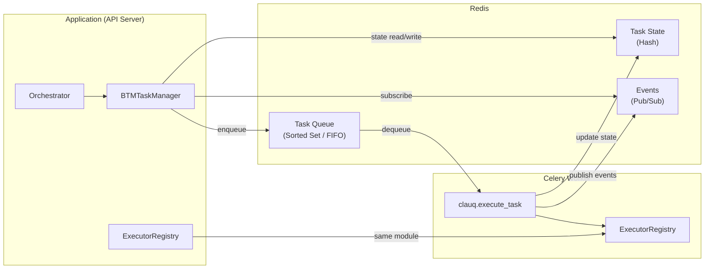

# Assistant Gateway

**Assistant Gateway** is a modular Python framework for building AI-powered chat assistants backed by LLM agents and REST tool integrations. It provides the full infrastructure needed to wire up an LLM agent to your backend services, manage multi-turn conversations, and expose everything as a pluggable REST API -- all with built-in support for background task execution via Celery and Redis.

---

## Table of Contents

- [Key Features](#key-features)
- [Architecture Overview](#architecture-overview)
- [Components](#components)
  - [Tools & REST Tools](#tools--rest-tools)
  - [Agent Configuration](#agent-configuration)
  - [Chat Orchestrator](#chat-orchestrator)
  - [ClauqBTM -- Background Task Management](#clauqbtm----background-task-management)
  - [REST API Endpoints](#rest-api-endpoints)
- [Getting Started](#getting-started)
- [Examples](#examples)

---

## Key Features

- **Tool Abstraction** -- Define tools as Python classes with Pydantic-validated inputs/outputs. Use the built-in `RESTTool` to connect your agent to any REST API in minutes.
- **Agent Configuration** -- Provider-agnostic agent interface with a ready-to-use Claude (Anthropic) implementation. Plug in your own LLM by implementing a single abstract method.
- **Chat Orchestrator** -- Full conversation lifecycle management: chat creation, message sequencing, interaction history, and session-scoped agent reuse.
- **Pluggable Chat Store** -- Swap between `InMemoryChatStore`, `FileSystemChatStore`, or implement your own (e.g., MongoDB, DynamoDB) by extending the `ChatStore` interface.
- **Background Task Execution** -- Run agent tasks synchronously or offload to Celery workers via the **ClauqBTM** task management system, with real-time progress via WebSocket events.
- **FastAPI Integration** -- A single `enrich_app_with_assistant_router()` call adds a full suite of chat endpoints to any FastAPI application.
- **Gateway Runner CLI** -- Launch FastAPI server and Celery worker together from a single command.

---

## Architecture Overview



---

## Components

### Tools & REST Tools

> `src/python/assistant_gateway/tools/`

Tools are the building blocks that let your LLM agent interact with external systems. Each tool has a **static configuration** (`ToolConfig`) and receives **runtime context** (`ToolContext`) at execution time.

#### Tool (Abstract Base)

All tools implement the `Tool` abstract class:

```python
from assistant_gateway.tools.base import Tool, ToolConfig, ToolContext

class MyTool(Tool):
    async def run(self, context: ToolContext) -> ToolResult:
        # Your tool logic here
        ...
```

Key abstractions:

| Class | Purpose |
|---|---|
| `ToolConfig` | Static config -- name, description, input/output Pydantic models, timeout, input overrides |
| `ToolContext` | Runtime context -- per-request input payload; immutable clone via `with_input()` |
| `ToolResult` | Execution result -- output data, error flag, optional raw response |
| `ToolRegistry` | Central registry for managing and looking up tool instances by name |

#### RESTTool (Concrete Implementation)

`RESTTool` is a ready-to-use `Tool` subclass for calling HTTP REST APIs. It uses `httpx.AsyncClient` and dynamically builds Pydantic input models from your query/payload schemas:

```python
from pydantic import BaseModel, Field
from assistant_gateway.tools.rest_tool import RESTTool

class AddInput(BaseModel):
    a: float = Field(description="First number")
    b: float = Field(description="Second number")

add_tool = RESTTool(
    name="add",
    description="Add two numbers",
    json_payload_model=AddInput,
    tool_level_input_overrides={"path": "/add", "method": "POST"},
)
```

RESTTool supports:
- **GET / POST / PUT / PATCH / DELETE** methods
- Query parameters, JSON payloads, and form data -- each validated via optional Pydantic models
- Configurable timeout and per-tool input overrides (e.g., fixed path/method)
- Automatic input schema generation for LLM function-calling

#### Input Override Hierarchy

Overrides are applied in layers, allowing flexible configuration:

1. **Tool-level** (`tool_level_input_overrides` in `ToolConfig`) -- e.g., fix the `path` and `method`
2. **Agent-level** (`agent_level_input_overrides` on the agent) -- e.g., inject a `backend_url`
3. **Runtime input** -- values provided by the LLM at execution time

---

### Agent Configuration

> `src/python/assistant_gateway/agents/`

Agents are the LLM-powered brains that receive conversation history and decide what tools to call.

#### Agent (Abstract Base)

The provider-agnostic interface:

```python
from assistant_gateway.agents.base import Agent

class MyAgent(Agent):
    async def run(self, interactions: List[AgentInteraction]) -> AgentOutput:
        # Call your LLM, return structured output
        ...
```

#### ClaudeBaseAgent (Claude Implementation)

A full-featured Claude agent that:

- Converts your `ToolRegistry` into Claude SDK `@tool`-decorated functions
- Streams Claude responses and parses them into structured `AgentOutput` (with steps, thoughts, tool calls, and results)
- Supports MCP (Model Context Protocol) server integration
- Generates JSON Schema from Pydantic models for tool input validation

```python
from assistant_gateway.agents.claude import ClaudeBaseAgent

class MyClaudeAgent(ClaudeBaseAgent):
    def get_mcp_server_options(self) -> ClaudeAgentOptions:
        return ClaudeAgentOptions(
            model="claude-sonnet-4-5-20250929",
            mcp_config=self.get_mcp_server_config(),
            system_prompt="You are a helpful assistant.",
            allowed_tools=[...],
        )
```

#### Agent Builder Pattern

Agents are instantiated via **builder functions** that receive runtime context:

```python
from assistant_gateway.chat_orchestrator.core.config import AgentConfig

agent_config = AgentConfig(
    name="my_agent",
    builder=lambda user_ctx, backend_ctx, fallback_cfg: MyClaudeAgent(...),
)
```

Builder functions receive `UserContext`, `BackendServerContext`, and `GatewayDefaultFallbackConfig`, enabling dynamic configuration per request (e.g., injecting auth tokens or backend URLs).

---

### Chat Orchestrator

> `src/python/assistant_gateway/chat_orchestrator/`

The orchestrator is the central coordinator that ties together chats, agents, and tasks.

#### ConversationOrchestrator

Manages the full chat lifecycle:

- **Chat management** -- create, retrieve, and update chats
- **Message handling** -- accept user messages, invoke the agent, persist responses
- **Interaction ordering** -- chronological sequencing with assistant responses linked to their user inputs
- **Task execution** -- synchronous (inline) or background (via ClauqBTM)
- **Concurrency control** -- per-chat locks to prevent concurrent operations
- **Task management** -- retrieve, interrupt, and rerun tasks
- **Event streaming** -- subscribe to real-time task events via WebSocket

#### ChatStore

Pluggable persistence for chat data and interactions:

| Implementation | Description |
|---|---|
| `InMemoryChatStore` | Dictionary-based, thread-safe with `asyncio.Lock`. Great for development. |
| `FileSystemChatStore` | Persists to a JSON file on disk. Suitable for local prototyping. |
| Custom | Implement the `ChatStore` abstract class for MongoDB, DynamoDB, PostgreSQL, etc. |

Interface:

```python
class ChatStore(ABC):
    async def create_chat(chat: ChatMetadata) -> ChatMetadata
    async def get_chat(chat_id: str) -> Optional[ChatMetadata]
    async def update_chat(chat: ChatMetadata) -> ChatMetadata
    async def append_interaction(chat_id: str, interaction: AgentInteraction) -> None
    async def list_interactions(chat_id: str) -> List[AgentInteraction]
```

#### AgentSessionManager

Caches agent instances per chat session, so MCP connections and tool state are reused across multiple messages in the same conversation.

#### GatewayConfig

Central configuration dataclass that wires everything together:

```python
from assistant_gateway.chat_orchestrator.core.config import GatewayConfig

config = GatewayConfig(
    agent_configs={"calculator": calculator_agent_config},
    chat_store=FileSystemChatStore(),
    clauq_btm=ClauqBTM(redis_url="redis://localhost:6379"),
    default_fallback_config=GatewayDefaultFallbackConfig(
        fallback_backend_url="http://localhost:5000"
    ),
)
```

---

### ClauqBTM -- Background Task Management

> `src/python/assistant_gateway/clauq_btm/`

**ClauqBTM** (Clau-Queue Background Task Manager) is a distributed task execution system built on **Celery** and **Redis**. It enables agent tasks to run in the background while clients receive immediate responses and track progress in real time.

#### Architecture



#### Key Components

| Component | Description |
|---|---|
| `ClauqBTM` | Main entry point. Manages Celery app, queue manager, and task manager. State machine: `NOT_STARTED` → `EXECUTORS_REGISTERED` → `SETUP_COMPLETE`. |
| `BTMTaskManager` | Unified interface for sync and background task execution, interruption, and completion waiting. |
| `CeleryQueueManager` | Redis-backed queue using sorted sets for FIFO ordering per `queue_id`. Stores task state in Redis hashes. Publishes events via Redis Pub/Sub. |
| `ExecutorRegistry` | Named executor functions registered by both API server and Celery workers. |

#### Execution Modes

| Mode | Behavior |
|---|---|
| **Synchronous** | Task runs inline in the request; response returned immediately. |
| **Background** | Task enqueued to Celery via Redis; client receives a task ID and polls or subscribes for updates. |

#### Event Types

Real-time events streamed via Redis Pub/Sub and exposed over WebSocket:

`QUEUED` · `STARTED` · `COMPLETED` · `FAILED` · `INTERRUPTED` · `PROGRESS`

#### Graceful Degradation

If Redis/Celery is unavailable, synchronous tasks continue to work. Background tasks raise `BackgroundTasksUnavailableError` with a descriptive error message.

---

### REST API Endpoints

> `src/python/assistant_gateway/rest_api/`

A pre-built FastAPI router that can be plugged into any FastAPI application with a single function call.

#### Plugging into your FastAPI app

```python
from fastapi import FastAPI
from assistant_gateway.rest_api.fast_api_rest_assistant.enrich import (
    enrich_app_with_assistant_router,
)

app = FastAPI()

enrich_app_with_assistant_router(
    app=app,
    config=gateway_config,
    api_prefix="/api/v1",
    router_tags=["assistant"],
)
```

This single call:
1. Creates a `ConversationOrchestrator` from your `GatewayConfig`
2. Sets up FastAPI lifespan (startup/shutdown hooks for orchestrator and Celery)
3. Injects the orchestrator via FastAPI dependency overrides
4. Mounts the router at your chosen prefix

#### Available Endpoints

| Method | Path | Description | Status |
|---|---|---|---|
| `POST` | `/chats` | Create a new chat session | `201 Created` |
| `GET` | `/chats/{chat_id}` | Retrieve chat metadata | `200 OK` |
| `GET` | `/chats/{chat_id}/interactions` | List all interactions (ordered) | `200 OK` |
| `POST` | `/chats/{chat_id}/messages` | Send a message (sync or background) | `200 OK` / `202 Accepted` |
| `GET` | `/chats/{chat_id}/tasks/{task_id}` | Get task status and result | `200 OK` |
| `WebSocket` | `/chats/{chat_id}/events` | Real-time task event stream | -- |

#### Request / Response Models

- **`SendMessageRequest`** -- `content`, `run_mode` (`sync` | `background`), `message_metadata`, `user_context`, `backend_server_context`
- **`SendMessageResponse`** -- `chat`, `assistant_response` (if sync), `task` (if background)
- **`CreateChatRequest`** -- `user_id`, `agent_name`, `metadata`, `extra_metadata`
- **`TaskResponse`** -- `task` (with `status`, `result`, `error`)

---

## Getting Started

### Installation

```bash
pip install assistant-gateway
```

### Gateway Runner (Recommended)

The built-in CLI launches both the FastAPI server and a Celery worker in a single process:

```bash
assistant-gateway --config path/to/gateway_config.py --app path/to/api.py
```

Options:
- `--fastapi-only` -- Skip Celery worker (sync-only mode)
- `--celery-only` -- Run only the Celery worker
- `--celery-required` -- Fail if Celery/Redis setup fails (default: graceful degradation)

### Manual Setup

1. **Define your tools** (or use `RESTTool` for existing APIs)
2. **Create an agent** by extending `ClaudeBaseAgent` (or `Agent` for other providers)
3. **Build a `GatewayConfig`** with your agent config, chat store, and optional ClauqBTM
4. **Enrich your FastAPI app** with `enrich_app_with_assistant_router()`
5. **Run** with `uvicorn` (and optionally a Celery worker for background tasks)

---

## Examples

For a complete working example -- including a backend calculator API, an Assistant Gateway configuration, and a Streamlit web UI -- see:

> **[`src/python/assistant_gateway/examples/`](src/python/assistant_gateway/examples/)**

The **Calculator Web App** example demonstrates:
- Defining `RESTTool` instances for arithmetic and custom operations
- Configuring a `ClaudeBaseAgent` with a tool registry
- Wiring up `GatewayConfig` with `FileSystemChatStore` and `ClauqBTM`
- Plugging into FastAPI via `enrich_app_with_assistant_router()`
- A Streamlit chat UI with sync and background execution modes
- Real-time task event updates via WebSocket

---

## Demo Video

[Watch the demo](https://drive.google.com/file/d/1wsH3lX51A3x3fRRNCjWMkUhGXOR9rB85/view?usp=sharing)
